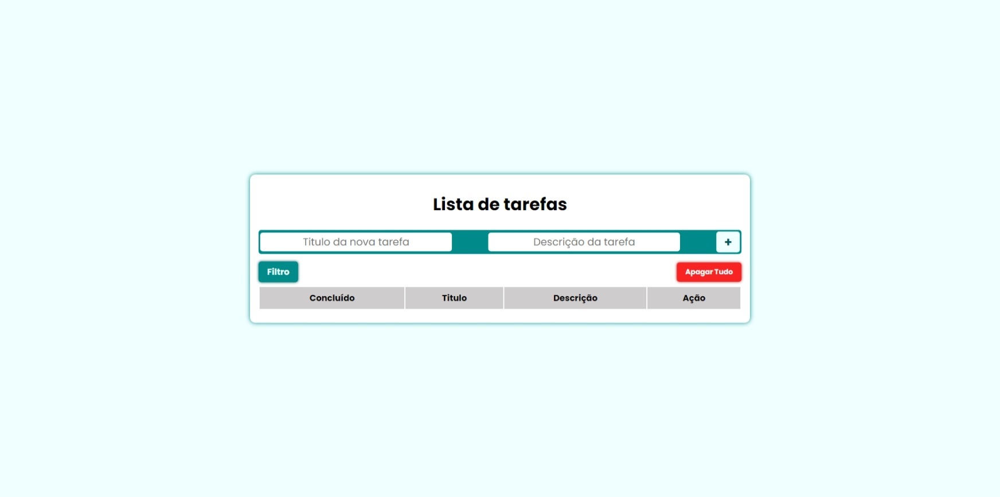

## Projeto Lista de Tarefas

🎉Bem-vindo ao **Lista de Tarefas!** Neste repositório, você encontrará uma lista de tarefas dinâmica e intuitiva. Este projeto não apenas oferece entretenimento, mas também demonstra várias técnicas avançadas de desenvolvimento de apicações web em JavaScript.

  

## Tecnologias

✨ **HTML5** e **CSS3** para a estrutura e aparência do jogo. 
✨ **JavaScript** para a lógica de programação e interatividade. 

## Funcionalidades Incríveis

🧧 **Adicione Nova Tarefas**: Inicie adicionando novas tarefas que serão armazenadas e visualizadas em seguina na tabela na View. 

🧧 **Sistema de Filtro**: visualize suas tarefas de acordo com o estatos dela, se já foi concluídas ou não.  

🧧 **Sistema de Estatos**: altere o estatos das tarefas, se já foi concluídas ou não.  

🧧 **Esclusão e Edição das Tarefas**: renovas tarefas ou as altere de acordo com sua necessidade.  

### Como Usar

1. Clone este repositório para sua máquina local.
2. Abra o arquivo `index.html` em seu navegador web.
3. Use as setas direcionais para mover o personagem e a barra de espaço para interagir.

🎁 Ou [Clique Aqui](https://billcarioca.github.io/lista-de-tarefas/) 

### Créditos

Este projeto foi desenvolvido como parte de um projeto educacional do curso Ada Tech, **Vem Ser Tech - Back End**. por [Bill Carioca](https://www.linkedin.com/in/billcarioca/) e 

---

Divirta-se aproveitando nossa **Lista de tarefas**  e deixar uma ⭐️ se você gostou do projeto!